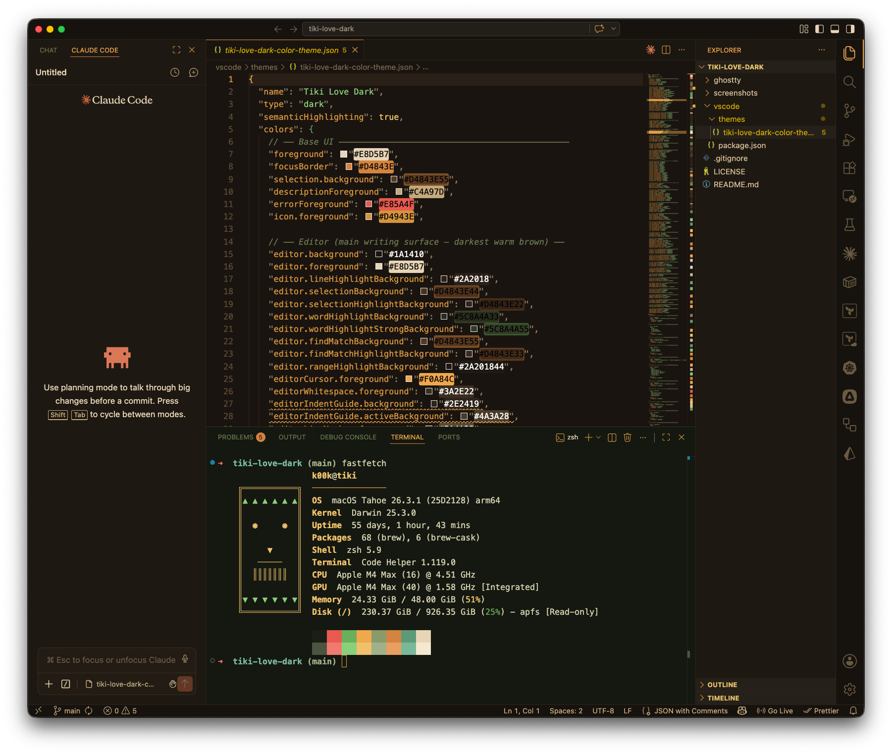
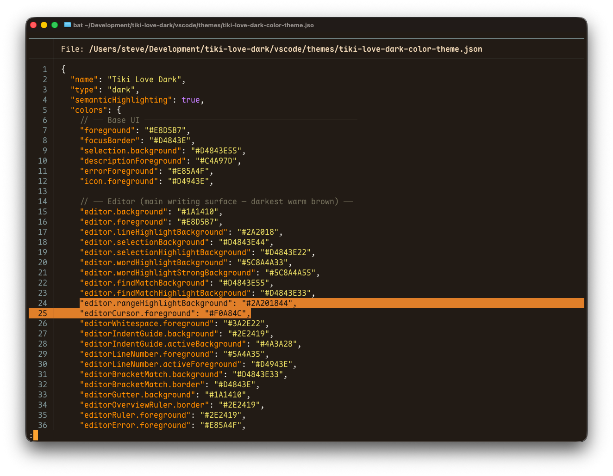

# Tiki Love Dark

> Tiki Love Dark — drags your shell into a 1972 Polynesian lounge. Carved-tiki browns, mai-tai-orange torches, bamboo-green strings, palm-frond sage types, hibiscus-red errors. Trader Vic's at closing time: wood paneling, lava lamps, Arthur Lyman on the hi-fi.

A warm, retro-tiki dark theme for **VS Code** and **Ghostty**. High readability, distinct panel colors, and color choices tuned for long coding sessions in low light.

## Screenshots

**VS Code** — editor theme with the integrated terminal running a custom tiki-head `fastfetch`:



**Ghostty** — `bat` highlighting the theme JSON:



## What's in this repo

```
.
├── vscode/      VS Code extension (package.json + theme JSON)
└── ghostty/     Ghostty theme file
```

## Install — VS Code

This repo contains the source of the extension; it is not (yet) published to the Marketplace. To install locally:

1. Clone or download this repo.
2. Copy the `vscode/` folder into your VS Code extensions directory and rename it to match the publisher/name/version convention:

   ```sh
   cp -R vscode ~/.vscode/extensions/steve.tiki-love-dark-1.0.0
   ```

3. Restart VS Code.
4. Open the command palette and run **Preferences: Color Theme**, then pick **Tiki Love Dark**.

Alternatively, package it into a `.vsix` with [`vsce`](https://github.com/microsoft/vscode-vsce):

```sh
cd vscode
npx vsce package
code --install-extension tiki-love-dark-1.0.0.vsix
```

## Install — Ghostty

1. Copy the theme file into Ghostty's user themes directory (no extension on the filename):

   ```sh
   mkdir -p ~/.config/ghostty/themes
   cp ghostty/tiki-love-dark ~/.config/ghostty/themes/tiki-love-dark
   ```

   > On macOS, Ghostty's main config lives in `~/Library/Application Support/com.mitchellh.ghostty/config`, but custom themes are loaded from `~/.config/ghostty/themes/`.

2. Add this line to your Ghostty config:

   ```ini
   theme = tiki-love-dark
   ```

3. Reload Ghostty (default: `cmd+shift+,`, or use your custom reload keybind).

### Optional: dim inactive splits

If you use splits and want the inactive ones to fade out clearly, add:

```ini
unfocused-split-opacity = 0.4
```

## Color palette

| Role            | Hex       |
| --------------- | --------- |
| Background      | `#1A1410` |
| Foreground      | `#E8D5B7` |
| Tiki orange     | `#D4843E` |
| Torch (cursor)  | `#F0A84C` |
| Bamboo green    | `#8ACF7A` |
| Palm-frond sage | `#6AAF5C` |
| Hibiscus red    | `#E85A4F` |
| Brass / gold    | `#F0C06C` |
| Lagoon (comment)| `#6A7A52` |

## License

MIT — see [LICENSE](./LICENSE).
